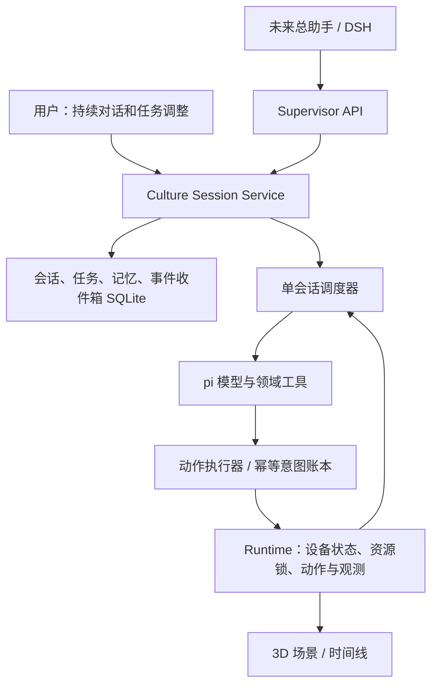

# OSCAR 长期培养会话：技术选型与 MVP 设计

状态：**待实施设计**；本轮只做调研与交接，不代表下面的接口已经存在。
日期：2026-09-30。代码基线：`d3a5525`，分支 `feat/b-framework`。

## 1. 已确认的产品方向

- 用户确认：**一个培养实验一个长期会话**作为 MVP。可跨多次对话、关闭浏览器、Agent 进程重启继续。
- 预留更高层总助手接口，让其了解并调用各个 Agent–设备–loop 的状态；本阶段不实现完整的总助手或多 Agent 自治协商。
- Agent 按“提交任务 → 收到设备结果/观测 → 决定下一步”工作。设备内部 1 s 仿真步和浏览器 RAF 不触发逐秒模型决策。
- 参考用户的 HistoPilot 多会话体验，保留任务记忆、任务状态和培养箱运行上下文。
- 本文暂以“持续监测，按条件维护并定期汇报”为首个长期验收任务，模型优先 DeepSeek；这是建议默认值，用户后续偏好可以覆盖。
- 仅针对现有虚拟培养设备，所有演示参数、图像来源继续显式标注。

## 2. 调研依据与技术选型

### 2.1 结论

**MVP：pi Agent Core + pi-ai 承担模型调用与工具循环；OSCAR Agent 服务自己持有长期会话、任务、事件收件箱和恢复账本。DSH 放在预留的上层编排位置。**

优先保留现有 TypeScript / Node 24 / SQLite / HTTP+SSE 架构。没有理由为了“3D Agent”迁移到游戏引擎、复制 Minecraft 协议栈或让 LLM 驱动机械臂每帧坐标。

| 方案 | 已核实的能力与边界 | 本项目选择 |
| --- | --- | --- |
| pi Agent Core / pi-ai | 自定义领域工具、模型调用、事件流、上下文转换、steering；HistoPilot 已采用 | 作为培养 Agent 的模型后端；不启动通用 coding CLI，不默认加载 shell/文件写工具 |
| DSH | Cordis 插件体系、SDK stdio JSON-RPC、session/prompt 与会话事件、JSONL 持久化；官方标为 developer preview | 预留高层委托适配；不作为本轮设备状态或调度账本 |
| pi-durable | 新增持久化 conversation/task/tool runtime；官方明确 experimental，API 可能变化 | 借鉴持久化原则，本轮不迁移现有 SQLite 到它 |
| HistoPilot | pi、独立服务、会话恢复、单调事件 seq、checkpoint、有限视觉工作集 | 复用设计与小型独立模块，领域接口另写 |
| Mineflayer / pathfinder | 高层动作 API、状态/库存查询、目标完成与执行失败事件、独立 Viewer | 借鉴动作与结果契约；不引入 Minecraft 专用依赖 |
| Voyager | 可组合技能库、环境反馈、执行错误与自校验、checkpoint | 建立显式版本的培养技能和复查；不照搬无限探索/任意生成代码执行 |
| Mindcraft | LLM + Mineflayer 的集成项目 | 作为技能调用和交互参考，不替代本项目的持久任务恢复机制 |

这里的“成熟”指可借鉴的接口与工程模式，不表示研究项目已经提供培养设备所需的账目一致性。

### 2.2 版本与兼容性

- 实际读取 HistoPilot `7c618ebdaf6ca90e677d6ded4ba93ec0b393b51e`；其 `package.json` 和 lockfile 将 `@earendil-works/pi-agent-core`、`@earendil-works/pi-ai` **同时锁为 0.84.0**。
- 实际读取 HistoPilot-DSH `798954954cdf8e5455e4f0b228bf0ec77b58ec12`。DSH 只注册高层工具并适配 HTTP/SSE，HistoPilot 继续拥有领域 loop。
- 调研时 npm registry 的 pi 两包 latest 为 **0.99.1**；DSH latest 为 **0.2.0-rc.2**。本机既有 DSH 安装是 **0.1.5-rc.3**。这些是不同版本，不能混用其示例。
- **MVP 默认与 HistoPilot 对齐，成对锁定 pi 0.84.0**；实施时验证 Node 24 与所需模型工具调用。如果选择升级，必须在第一阶段记录原因、锁定具体版本、先跑后端契约烟测。不要直接跟随 `main` 或使用浮动版本。
- HistoPilot 使用旧 `shouldStopAfterTurn`；当前 pi main 文档已描述 `finishTurn`。后续实现必须按所选发布版本的类型与文档接入，不能拼接两代 API。
- 没有在本轮安装 pi 或运行真实付费模型；上述是源码/文档选型，不是已完成的性能或稳定性实测。

### 2.3 HistoPilot 的可复用映射

| HistoPilot | OSCAR |
| --- | --- |
| slide → main session | `(runtime_instance_id, experiment_id)` → 唯一培养会话 |
| messages + 单调 session_message_seq | 持久对话，消息与设备事件采用独立序号 |
| context checkpoint / compaction | 任务摘要 + 原始消息区间 + 观测引用 |
| image_ref / visual working set | observation_id、asset_id、hash、板 revision、采样时间 |
| snapshot review guard | 需要视觉证据的决策必须消费有效扫描，不能用旧摘要代替新观测 |
| PlatformClient | DeviceClient，Agent 不读 Runtime 数据库 |
| session selection generation | 切换会话后拒收旧会话的迟到响应 |
| HistoPilot-DSH 的 run/continue/session/cancel | OSCAR 上层任务委托、查询、订阅、暂停/恢复/取消接口 |

HistoPilot 的历史架构文档已注明部分内容过期，本轮以当前 README 和 `src/session-store.ts`、`src/agent-runner.ts`、`src/transform-context.ts`、`src/checkpoint.ts` 等实际代码为依据。其切片坐标、标注语义及只读 extra-tools 契约不适合直接套到换液写操作。

HistoPilot-DSH 的 `histopilot_run` 会等 SSE 任务结束；培养任务可能跨天，OSCAR 上层接口应立即返回 `task_id`，由查询/事件订阅取得后续结果。订阅中断只影响观察，不自动取消设备任务。

### 2.4 游戏 Agent 的具体借鉴

1. **高层目标与执行分离**：类似 pathfinder 接受 goal 并反馈 `goal_reached`、`noPath`、`stuck`，OSCAR 接受整排换液并反馈动作 ID、阶段、终态及部分效果。
2. **可复用技能**：`scan_and_assess`、`exchange_row_and_verify`、`mix_and_rescan`、`monitor_until`。技能由已审核的设备能力组合，参数、前置条件、后置检查、失败分支和版本显式保存。
3. **观察—计划—执行—验证**：动作成功只说明设备完成操作；培养目标达成还需要后续观测证据。
4. **长期记忆**：记住做过什么、为什么做、结果和未解决的问题；重新查询当前设备状态后再执行。
5. **3D 展示解耦**：Agent 用逻辑资源 ID 和证据工作；3D 场景继续订阅 Runtime 权威状态。扫描图像可供视觉模型分析，屏幕截图只做辅助诊断，不作为移液量或动作完成的权威来源。

## 3. 系统边界



- **Runtime**：唯一设备事实来源，维护体积、库存、腔室读数、动作、锁、扫描资产、实验时钟；已完成效果不可由 Agent 或 UI 回滚。
- **Agent 服务**：目标、计划、对话、记忆、待办、唤醒条件、模型预算、恢复与结果解释。
- **pi**：一次有限决策过程里的模型与工具循环；模型 turn 结束不代表培养任务或会话结束。
- **上层助手**：委托目标和查询状态，通过同一控制入口调整任务；不得绕过当前培养 Agent 的资源与权限控制直接抢占设备。

## 4. 数据与生命周期

### 4.1 会话、任务、运行的关系

```text
Device / Runtime instance
  └─ Experiment
      └─ CultureSession（MVP 唯一长期会话）
          ├─ Messages / Memory checkpoints / Evidence references
          ├─ Task A（监测目标，可包含多次维护周期）
          │   ├─ Plan revisions / steps / wake conditions
          │   └─ Runtime Run / Actions / Observations
          └─ Task B（后续追加任务）
```

- 不把 session_id、task_id、run_id、action_id 混成一个 ID。
- MVP 同一会话只有一个主动执行/监测任务，额外任务排队；允许讨论与查询当前任务。
- 当前 Runtime 是**一个当前实验 + 历史归档**，不能仅新增多个聊天标签就宣称同一培养箱支持多个并行实验。历史实验会话可回看，写入仍按现有归档限制拒绝。
- 多设备未来通过稳定的 runtime_instance_id/device_id 路由；不要把各服务都会生成的 `exp-001` 当全局唯一身份。
- 完成一次扫描/换液循环只完成一个计划步骤；达到长期任务终止条件才结束 Task/Run；会话仍可继续接收新任务。
- reset 生成新 Experiment 和新会话绑定。旧会话封存写能力，保留来源关系；可显式复制目标模板，不能复制在途动作与未消费指令。

### 4.2 最小持久化对象

建议在现有 Agent SQLite 中增量迁移，不引入第二个业务状态真相源。

| 对象 | 关键字段 |
| --- | --- |
| Session | id、runtime_instance_id、device_id、experiment_id、lifecycle、backend、schema_version、created/updated_at、last_session_seq |
| Message | session_id、message_id、seq、role、content/asset_refs、request_id、task_id、created_at |
| Task | id、session_id、goal_text、goal_spec、goal_revision、status、reason、active_run_id、budget、completion_conditions |
| PlanStep | id、task_id、plan_revision、skill/version、inputs、depends_on、status、action_ids、evidence_refs、postconditions |
| Wake | id、task_id、kind、predicate/target_sim_s、source_watermark、status、dedupe_key |
| Inbox | source、runtime_instance_id、experiment_id、source_seq、payload_ref、processing_state、dedupe_key |
| Intent | durable operation_id、task/plan/step/revision、原 run_id/principal、canonical_request、idempotency_key、action_id、state |
| MemoryCheckpoint | generation、covered_message_seq、goal_revision、summary、facts、open_questions、evidence_refs、schema/model/tool versions |

Task 状态至少区分：draft、ready、running、waiting_device、waiting_condition、needs_input、paused、completed、failed、cancelled。循环状态另外报告 idle/thinking/executing/waiting/recovering/unavailable，不能用一个“运行中”涵盖所有情况。

每次状态变化附稳定 reason code；消息接收、任务创建、上层命令使用 request_id 幂等。预算同时覆盖单次决策、任务累计动作和模型用量；不能通过新建 run 逃避累计预算。

## 5. 目标与计划

把“一个 goal 文本框”升级为自然语言对话 + 可检查的结构化任务。

GoalSpec 至少包括：目标描述、资源范围、目标指标/来源、采用的演示或用户协议 profile/version、允许操作、监测条件/周期、期限及其时钟域、成功条件、停止条件、动作/模型预算、未知参数。

- 任务不是简单地把自然语言匹配到当前 scenario_id。场景提供仿真初始条件；用户目标与任务计划独立保存。
- 参数来自用户、选定协议或明确记录的演示 profile；缺少执行必需参数时进入 needs_input，不能凭空猜一个培养协议。
- 参数齐全且在用户已授权范围内，可自动执行并显示计划；不要求用户逐动作确认。
- 计划步骤与观测绑定，支持在未完成任务中追加约束或调整目标。修改 goal_revision，旧决策在提交动作前必须重新校验版本；已提交的效果进入历史，不能假装撤销。
- “完成换液”与“达到培养目标”分开判定。条件不达标时重新观察、受限重试或请求用户处理，不允许无限修正循环。
- 简短决策理由、工具调用和证据可见；不把隐藏推理全文作为任务记忆的必需内容。

## 6. 事件驱动调度与两种时钟

### 6.1 唤醒来源

用户新消息/任务修改、动作终态、目标观测到达、环境阈值跨越、显式监测期限、设备异常/恢复、人工接管/恢复。

clock 帧、动画帧、普通心跳只更新显示或投影。模型不因每个温度采样或每秒时钟被调用。监测规则采用明确条件、去抖/滞回与最小间隔；持续越界不得每秒重复触发同一维护任务。

### 6.2 双模式

- **realtime 是长期运行的产品路径**：Runtime 按自身时钟运行，Agent 等待设备事件；模型延迟期间环境继续变化，提交动作前重新取状态与检查证据新鲜度。
- **lockstep 保留为确定性验收路径**：复用现有 decision lease；持有时进行有限决策，提交动作后登记 wait 并释放 lease，由 Runtime 推进，结果到达后再获得决策机会。
- `await_actions` 在 lockstep 不能一边持有 lease 一边等动作完成，否则死锁。应先把等待条件持久化并释放 lease，结束此次模型执行，收到唤醒再继续同一会话。
- realtime 使用自己的订阅、持久化游标和唤醒队列，不伪造 lease，不只是删除当前 realtime 禁用判断。
- 等待操作返回的是“已登记等待”，不能作为“动作成功”的 tool result；后续终态作为新的设备结果进入上下文。
- 培养周期/静置按 sim_time；网络超时、进程心跳、模型重试、租约 TTL 按 wall_time。任意 deadline 都标明 clock_domain。

### 6.3 单写者与消息插入

每个会话同一时刻只有一个调度者推进有副作用的计划；持久化 owner/fencing generation 或等价机制阻止旧进程、旧模型响应提交动作。用户在模型运行时的调整持久入队；更新目标先使旧版本写入失效，再在安全边界处理当前已提交动作。

暂停 Agent = 停止新决策/新动作；取消 Task = 明确调用 Runtime 取消未完成动作并对账；暂停 Runtime = 停止仿真时钟。UI 将这三种控制分开。仅关闭浏览器/订阅，不触发任何一种控制。

## 7. 记忆与恢复

### 7.1 三类信息分开

1. **用户与任务记忆**：目标、约束、已确认参数、计划变更、未解决问题。
2. **过程与证据记忆**：动作及结果 ID、观测、复查、异常和恢复记录。
3. **当前设备投影**：带 sampled_at_sim_s、event_seq、revision 和 freshness 的状态引用；每次决策重新读取，旧摘要永远不覆盖 Runtime 当前事实。

上下文按需组装为“稳定任务约束 + checkpoint 摘要 + 最近对话 + 待处理事件 + 最新设备投影 + 有限证据”。先使用 SQLite 索引与 ID 查询；MVP 无需向量数据库。

扫描图片保存 observation_id/asset_id/hash/板 revision/采样时间，按需取图。压缩保留未完成动作、等待条件、约束、来源和区间水位；tool call/result 配对完整。缺图、hash 不匹配、旧证据应显式标记，需要视觉判断时重新扫描或请求处理，不能声称看到了图片。checkpoint 用 generation CAS 防止迟到摘要覆盖新目标。

### 7.2 恢复顺序

1. 加载会话、任务、消息和 inbox 游标；获取调度所有权。
2. 从 Runtime 读取当前 Experiment 身份、状态、动作、库存、观测、时钟和 run 状态。
3. 对每个不确定 intent 查 action_id 或原幂等键对应的操作；确认结果后补记本地账本。不能把网络超时当作未受理。
4. 先补消费动作终态和恢复事件，再恢复计划/等待，再允许新模型决策。
5. 重启不得发出第二次同义加液。旧 run 的授权与幂等作用域不能被新 run 随意替换；需要跨 run 查询时增加明确的会话范围协调接口，不给模型 operator token。
6. SSE 至少一次投递，通过 source+scope+seq 去重；持久化输入和游标更新需原子，重放、乱序、重复与流缺口均有处理策略。事件日志截断时先重取快照，再恢复有效游标。
7. Runtime 退出时不假装继续培养；恢复后显示其实际 paused/restarted 状态。不自动补算离线培养时间，除非另有明确设计。

## 8. 后端与领域工具接口

建议 `AgentBackend` 暴露 loadContext、runDecision、interrupt、close、capabilities 等职责；具体签名由类型约束细化。接口报告 tools/images/streaming/compaction 能力，模型配置由服务端注入，不进入模型可见工具参数或会话日志。

pi 只注册 OSCAR 工具：读取设备/任务、取观测与图片、规划或修改任务、提交能力动作、登记等待、记录评估、结束当前决策。已有 manifest 是设备参数 schema 的来源。

写工具与受影响的 plan 更新串行；默认不能让 SDK 的并行工具批次同时提交两次移液。读取可并行，但需要注明对应快照水位。

所有工具执行经过同一个执行器，校验实验绑定、用户授权范围、goal revision、资源/证据 revision、预算及幂等键。LLM provider 重试与设备动作重试分开；模型调用重试不能重放已经提交的副作用。

模型或凭证不可用时持久记录 needs_configuration/model_unavailable 并反馈 UI；scripted 只在显式选择时作为测试/演示后端，禁止静默 fallback。模型选择独立于 pi/DSH：pi 是运行框架，不等同于某一家模型服务。

## 9. API、UI 与未来总助手

以下是待实现契约草案，统一挂在现有 Runtime 同源网关之下，复用配对与授权。

| 操作 | 建议端点/行为 |
| --- | --- |
| 列出会话、读取会话 | `GET /api/v1/agent/sessions`、`GET /sessions/:id` |
| 当前实验建立/获取唯一会话 | 幂等 `POST /api/v1/agent/sessions`，不能给归档实验创建写会话 |
| 继续对话 | `POST /sessions/:id/messages`，request_id 幂等，返回 message_id/入队状态 |
| 会话事件 | `GET /sessions/:id/events?after_seq=`，独立 session_seq 和可恢复 SSE |
| 创建/读取/调整任务 | `/sessions/:id/tasks`、`/tasks/:id`；更新带 expected_revision |
| 控制任务 | `/tasks/:id/control`：pause/resume/cancel，语义与 Runtime 控制区分 |
| 聚合运行摘要 | `/sessions/:id/status`：任务、loop、设备、时钟、在途动作、下次唤醒、异常、预算、水位 |

MVP 页面：实验会话列表、持续对话区、当前目标/计划、等待原因与下次检查、已执行动作/证据、记忆摘要、独立设备状态。消息发送不重建 3D 场景；切换归档会话不停止当前任务；浏览器断开后服务继续运行。

未来总助手接口与上述服务共用逻辑，提供 `list/status/submit_task/update_task/pause/resume/cancel/subscribe`。请求含 delegated_principal、scope、request_id、expected_revision；授权在服务端验证，不能信任调用方自称的身份。上层能看到哪个设备、哪个会话、哪个任务和 loop 在做什么、等待什么、状态多新，不获得内部 token 或任意设备写入口。

本阶段不必实现 DSH 插件；可提供契约测试用的外部客户端，证明无需 DOM 或读数据库即可完成委托和查询。之后按 HistoPilot-DSH 的薄插件方式接入。

## 10. 实施顺序与验收

| 阶段 | 结果与必要验收 |
| --- | --- |
| D0 | 先修复既有取消载液、重启摇床、reset 归档对账、Agent 停止竞争问题；见 NEXT_IMPLEMENTATION_HANDOFF |
| D1 | Session/Task/Message/Inbox/Checkpoint schema 与迁移、API 和事件恢复；同一实验只能创建一个长期会话 |
| D2 | 统一事件调度，realtime 真正可用，同时保留 lockstep；持有 lease 时不等待动作，空闲采样不唤醒模型 |
| D3 | pi adapter、真实模型配置、结构化目标、受控工具、有限上下文与记忆；多轮对话能调整现有任务 |
| D4 | 长期会话 UI 与 Supervisor API 契约；归档、当前实验和设备状态区分 |
| D5 | 模型桩 + 真实进程故障 + 浏览器 + 长时模拟验收；有配置时真实模型演示；无配置时明确列出未验证项 |

核心验收：

- 一个会话接受初始目标、追问和约束调整，任务持续；一次维护完成不结束整个会话。
- 至少 24 个模拟小时、3 次以上监测唤醒、至少一次需要操作和一次不需要操作的决策；次数与阈值由演示协议显式设置，不能由随机模型输出决定测试能否完成。
- 用户中途改变排范围/操作限制，旧目标产生的迟到模型响应不能写设备。
- 浏览器关闭、Agent SIGKILL、Runtime SIGKILL、动作已受理但响应丢失、SSE 重复/缺口分别验证；逐孔体积和库存守恒，不重复动作。
- 模型延迟/失败时 realtime 仍推进；重新决策前刷新状态；lockstep 保持确定性测试。
- 暂停/取消/人工接管的行为清晰，无后台继续偷偷提交；模型缺失不降级 scripted。
- 强制压缩后目标、未完成动作、证据和待办保留；会话之间不串消息、观测或权限。
- 对固定数量的有意义唤醒，模型调用有明确上界；只有 clock/正常传感器更新时调用次数不增长。
- 状态更改使用真实 HTTP 与进程测试；模型桩通过真实 provider wire/工具协议接入，不能绕过 AgentBackend 和调度器直接生成动作来冒充 LLM 验收。

暂缓：多个实验同时占用同一培养箱、完整总助手、多 Agent 自治协商、任意在线代码技能学习、向量数据库、实机标定和取头几何。它们不阻塞本阶段长期会话闭环。

## 11. 来源与阅读记录

公开资料均于 2026-09-30 查阅；社区 main 可能继续变化，实施应按锁定版本重新验证 API。

- [pi Agent Core 文档](https://github.com/earendil-works/pi/blob/main/packages/agent/README.md)：工具循环、上下文转换、事件、控制及版本变化。
- [pi 主仓库](https://github.com/earendil-works/pi)：包名与模块边界；旧 badlogic/pi-mono 地址会重定向。
- [pi-durable](https://github.com/earendil-works/pi/tree/main/packages/durable)：实验性 durable conversation/task 方案。
- [DeepSeek Harness](https://github.com/deepseek-ai/deepseek-harness)：developer preview、插件架构；SDK 能力同时核对了本机安装包 README。
- [DSH Python SDK](https://github.com/deepseek-ai/deepseek-harness/blob/master/python/sdk/README.md)：stdio JSON-RPC、持久 home/session 和 prompt 入队；这里只作为协议参考，不建议给当前 TS 项目再增加 Python 中间层。
- 本机 DSH `dsh-sdk-jsonrpc-server`、`dsh-session`、`dsh-sdk-minimal`、`dsh-schedule` README：sdk-minimal 默认只有 shell，并非现成领域工具隔离层；schedule 是会话提醒，冷会话到期后可能等恢复才投递，不能直接当培养箱调度器。
- [Mineflayer](https://github.com/PrismarineJS/mineflayer)：高层状态/动作 API 与独立 Viewer。
- [mineflayer-pathfinder](https://github.com/PrismarineJS/mineflayer-pathfinder#events)：目标与路径结果事件。
- [Voyager](https://github.com/MineDojo/Voyager)：技能库、执行反馈、自校验与 checkpoint。
- [Mindcraft](https://github.com/mindcraft-bots/mindcraft)：LLM 与 Mineflayer 集成参考。
- [HistoPilot 固定源码](https://github.com/solarise94/HistoPilot/tree/7c618ebdaf6ca90e677d6ded4ba93ec0b393b51e)：用户授权访问的私有仓库，已实际读取；参考其会话与上下文设计，不复制领域实现。
- [HistoPilot-DSH 固定源码](https://github.com/solarise94/HistoPilot-DSH/tree/798954954cdf8e5455e4f0b228bf0ec77b58ec12)：高层委托边界参考。
