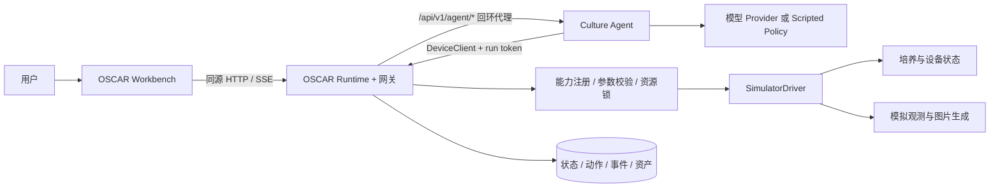
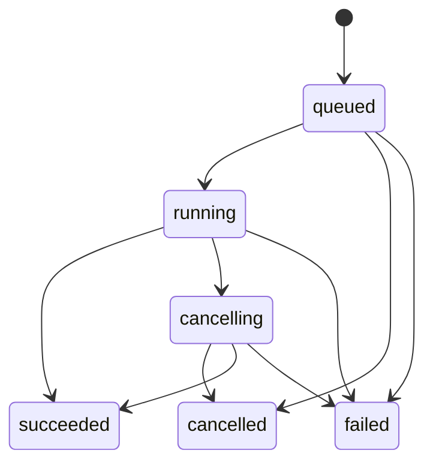

# OSCAR 虚拟培养设备与 Culture Agent 工程设计

状态：Draft · 第三轮 Review 已修订；R1–R11 已确认，作为 P0 基线

版本：0.4 · 2026-09-29

范围：演示性类器官自动化培养设备、设备 API、培养 Agent、3D 操作台

分工补充：2026-09-30。技术基线仍为 v0.4，R1–R11 不变。实现分为 **A：3D 模型与场景升级（本聊天助手负责）** 和 **B：其余系统实现（用户另行安排的执行代理负责）**，具体文件边界和交接要求见 [实施分工与交接](WORK_ALLOCATION.md)。分工文档建立时 A 尚未启动；2026-09-30 用户已授权本聊天实现 A，场景侧交付见 [场景交接](SCENE_HANDOFF.md)。本聊天不启动或调度 B。

### 2026-09-30 用户补充：排枪整排加液

用户明确加液站为排枪，必须整排对应样本孔并同时加液。此要求覆盖本文原「单逻辑通道」简化。当前 A 的 24 孔展示板每排 6 孔，场景采用 6 通道/21.6 mm 针距配置，一次对齐 A1–A6 等完整一排；原 GLB 八针参考与此布局不匹配，由运行时几何调整。B 需对应实现排级并行动作与逐孔液量/吸头记账，实际硬件通道数不由展示模型推断。详见 [场景交接](SCENE_HANDOFF.md)。

### v0.4 修订要点

修正 v0.3 中三条会互相打架的规则，R1–R11 不变：

1. **GET/HEAD 与写请求分开校验 Origin**：浏览器同源 GET/HEAD 通常不带 `Origin`，仍可用会话 cookie。只有非 GET/HEAD 且不带 `Origin` 时才忽略 cookie、只认 Bearer（§6.6、§9）。
2. **已有屏障时不换租约**：受理事务内立即终态的动作只把触发追加到当前屏障，`lease_id` 不变。`release` 时若唤醒条件已经满足，在同一事务里交出下一屏障，不等待不会再次发生的终态事件（§5.3、§9）。
3. **Reset 不建无主屏障**：新 Experiment 处于无活跃 run、仅手动 `step` 的静止状态。首个屏障只在新 run 启动时建立（§5.1）。

### v0.3 修订要点

补齐 4 条进入 P0 前必须明确的执行契约：

1. **lockstep 时钟交接**：决策屏障改由 Runtime 建立。动作终态或唤醒边界与屏障写在同一事务里，之后才通知 Agent；租约的签发、续期、释放、超时和过期拒绝都有明确规则（§5.3）。
2. **Origin 校验按凭证区分**：浏览器会话必须带同源 Origin；Node DeviceClient 和 CLI 默认不带 Origin，只能用 Bearer token 加 scope 认证，缺 Origin 且无有效 token 的写请求一律拒绝（§6.6）。
3. **令牌首次交付**：页面 HTML 不再包含任何令牌。loopback 模式用启动时打印的一次性配对链接，LAN 模式先验证预配置访问码，二者都换成 HttpOnly 会话 cookie（§6.6）。
4. **Reset 终止旧世界执行器**：reset 在单个事务中冻结时钟、撤销租约与写权限、终结未完成的动作、释放资源，再完成归档并创建新世界；所有状态提交都检查 Experiment 仍为 active（§5.1）。

### v0.2 修订要点

对照 GLB 节点、`web/app.js` 与本机 Node 运行时核查后，修订了以下会影响实现的问题：

1. **时钟可重现性**：v0.1 的模拟时钟随 wall time 推进，scripted 演示和自动化测试会因机器快慢和模型延迟得到不同结果。新增 `lockstep` 时钟，推进时不越过调度边界（§5.3）。
2. **reset 语义简化**：去掉 `epoch`，reset 改为创建新 Experiment 并归档旧 Experiment，所有表和请求不再需要额外的代次维度（§5.1、§6.4）。
3. **版本与互斥**：全局 `command_revision` 改为资源级 revision；有资源占用冲突时直接拒绝，不排长队；观测新鲜度按板 revision 判断（§6.5）。
4. **3D 映射**：补充真实节点命名、孔位编号换算、glTF 轴向、静态合并的影响、针距与孔距不匹配、针尖离板面仍有间隙等约束，并给出初始工位分配（§8.2）。
5. **物理设定缺口**：明确环境受控腔室、相机安装位置、shake 位置和吸头耗材，首版不需要转运培养板（§5.1、R8–R10）。
6. **本地写接口安全**：增加 Host/Origin 校验、operator/run 令牌，并要求 `--lan` 必须使用令牌（§6.6）。
7. **工具命名与读写映射**：工具名由 capability 名机械生成（`.` 替换为 `_`），读能力对应 GET，写能力对应 `POST /actions`（§6.2、§7.1）。
8. **技术落点**：使用 Node 24 内置的 `node:sqlite`、类型剥离和 `node:test`，并用自研确定性 PNG 编码，尽量减少运行时依赖（§4.1、§8.3）。

## 1. 设计结论

建议把现有 OSCAR 3D 展示升级为一个**有状态、可操作、可观察、可回放的虚拟培养设备**。Agent 接收培养任务，通过设备能力接口获取环境和图像、加注或更换培养基、调整环境、振荡培养板，再观察操作效果。

采用三个职责边界：

1. **OSCAR Workbench**：3D 设备、培养板、相机画面、环境趋势、人工控制和 Agent 面板。
2. **OSCAR Runtime**：设备状态唯一来源；执行操作、推进模拟时间、生成观测、保存动作与事件，同时作为同源网关。
3. **Culture Agent**：理解目标、读取证据、选择操作、等待完成、复查和总结；通过接口访问 Runtime。

沿用 PathTogether / HistoPilot 的“平台与 Agent 分离、能力契约、图像证据、会话回放”思路。首版在本仓库开发，采用模块化单体和独立 Agent 进程，不要求先改造两个参考仓库。

MHS 部分按其公开的设备驱动与能力发现思路设计，定义本项目的 **`oscar-mhs-demo/0.1` 应用契约**。本文中的 manifest、HTTP 路径、状态机和字段均为工程提案，不宣称已通过官方 MHS 兼容性验证。

### 推荐首版范围

| 项目 | 决策 |
| --- | --- |
| 设备规模 | 一台 OSCAR、一个环境受控腔室（即主工作舱）、一个运行中的培养任务 |
| 培养对象 | 数据结构支持多板多孔；默认演示一块 24 孔板的少量活动孔 |
| 工位 | 培养板固定在台面工位，不转运；相机随移液头移动，shake 在原工位进行 |
| 液体操作 | 加液、按比例换液；底层展开成确定性的整排并行移液步骤 |
| 图像 | 单目和双目模拟扫描；培养液外观与类器官示意图分开呈现 |
| 环境 | 温度、CO₂、湿度的设定值、观测值及变化趋势 |
| 振荡 | 培养板级 shake，具备开始、完成、中止和状态反馈 |
| Agent | 确定性演示策略 + 可选真实 LLM 工具调用，两者共用设备 API |
| 时间 | Agent 运行与测试默认 lockstep 时钟，结果不受模型延迟影响 |
| 仿真程度 | 操作与状态有因果关系；机械细节和生物学变化采用可解释的简化规则 |
| 运行方式 | 本地启动；不依赖 PathTogether 服务或 HistoPilot 数据库 |

首版不包括完整实验流程、培养基配方优化、真实控制器接入、精确流体/生物学仿真、培养板转运、多人协作、计费或通用插件市场。

## 2. 参考仓库：借鉴什么，在哪里调整

本节依据 2026-09-29 读取的源码快照，固定提交见 §13。历史设计文档中的部署形态与当前 README 不完全一致，以下以当前 README 和关键代码为准。

### 2.1 PathTogether：平台拥有资源，插件消费能力

PathTogether 将切片、Viewer、标注、权限和审计留在平台，把 AI 导航拆给独立 HistoPilot；两者通过版本化 HTTP 契约连接。其插件设计还区分 manifest、API、UI bridge 和产品版本，并用能力声明与统一 dispatch 收口调用。[P1][P2]

对 OSCAR 的映射：

| PathTogether 概念 | OSCAR 中的对应物 |
| --- | --- |
| 切片及其资源身份 | 培养任务、培养板、孔位和扫描资产 |
| Viewer | OSCAR 3D 场景与培养观察面板 |
| 标注和审计 | 观察记录、动作记录、培养日志 |
| Plugin Contract / PlatformClient | Device Contract / DeviceClient |
| HostBridge | WorkbenchBridge：聚焦培养板、展示扫描、定位时间线 |
| 能力注册与 dispatch | 设备 manifest 与统一操作入口 |

首版只保留小型 WorkbenchBridge，不建设完整插件宿主。当前 PathTogether 的 HostBridge 实际采用同窗口函数分发，不能把它理解为已实现 iframe 隔离。[P3]

### 2.2 HistoPilot：先观察，再行动，保留证据

HistoPilot 将 Agent loop、工具、会话、SSE 和上下文管理放在独立服务中，通过 `PlatformClient` 访问平台。源码还提供了快照观察守卫、图像引用、上下文 checkpoint、有限视觉工作集及持久化事件序号。[H1][H2][H3][H4]

OSCAR 对应采用：

- `DeviceClient` 隔离 Agent 与设备实现，Agent 不直接读设备数据库。
- 扫描后记录结构化观察，写动作引用触发它的观测证据。
- 图像以 `asset_id + content_hash` 保存引用；模型只接收当前必要图片。
- 会话记录“目标、观察、动作、结果、复查”；前端可点选事件回看证据。
- 长任务由 Runtime 执行，Agent 等待事件或定时观察，不为每一帧动画调用模型。

**不能直接复用的部分：** HistoPilot 当前 `extra_tools` 解析器只接受 `access_mode="read"`，且其平台契约带有切片、标注和导航语义。把换液包装成只读插件会破坏语义；本项目应创建独立培养工具集。如未来需要接回 HistoPilot，再显式扩展写操作契约和运行授权。[H2]

不直接复制其全部会话、缓存和计费体系。首版实现最小的会话持久化、图片引用、事件恢复及调用预算；跨项目复用成熟模块可在功能稳定后单独抽取。

### 2.3 MHS 的依据与本项目边界

MHS 官方公开介绍提出：标准化设备驱动、设备发现、读写原语、自然语言设备标注（进而生成包含可测量项、可调项与安全限值的参考文件），以及经 MCP、CLI 或代码 API 供 Agent 使用；长时或高频任务由 Agent 把驱动命令串成确定性脚本执行。公开页面以 research preview 描述项目，尚未开源；本次未取得正式规范或 SDK。[M1]

由此提出以下**本项目实现选择**：

| 设计方向 | OSCAR 应用契约 |
| --- | --- |
| 可发现 | 查询设备清单和版本化 manifest |
| 可理解 | 能力描述、参数 schema、单位、服务端强制的限值、典型用法 |
| 可读取 | 环境、库存、动作状态、扫描及证据引用 |
| 可操作 | 明确副作用的异步 procedure，返回 action ID |
| 确定性编排 | 加液/换液等复合动作由执行器展开为原语，不让模型逐步推理 |
| 可替换驱动 | 首版 SimulatorDriver，未来实现 HardwareDriver |
| 多种调用入口 | HTTP 为首版权威接口，MCP/CLI 后续映射同一契约 |

MCP 是可选的工具传输入口；本项目的设备状态、单位和执行规则由 Device Contract 定义。未来拿到正式 MHS 规范时新增映射适配层，并通过契约测试检查差异。

## 3. 演示应该让人看到什么

用户输入：“照看这批类器官，观察培养状态，必要时补液或换液，维持环境并记录结果。”

一轮完整演示：

1. Agent 发现 OSCAR 的能力，读取培养任务、可操作孔位及当前环境。
2. 扫描选定培养板，观察液位、颜色、浑浊度和类器官示意图。
3. 在面板说明可核对的决策依据，例如“模拟图像显示液位下降，先补液并复查”。
4. 调用 `media.add` 或 `media.exchange`，Runtime 返回 action ID。
5. 3D 显示移液头取吸头、移至储液位、逐孔吸排液及液位变化；时间线同步显示执行阶段。
6. 按任务预设调整环境，并在需要时执行一次 shake。
7. 等待环境稳定或操作完成，再扫描，显示前后对比。
8. 生成小结：做了什么、使用什么证据、结果如何、下一次观察何时发生。

提供三个预置场景：

| 场景 | 主要展示点 | 完成条件 |
| --- | --- | --- |
| 例行维护 | 扫描 → 识别补液需求 → 加液 → 复查 | 液位进入演示目标区间，记录动作与证据 |
| 换液与混匀 | 扫描 → 换液 → shake → 等待 → 复查 | 换液体积账一致、振荡完成、前后图可比较 |
| 环境偏移与观察失败 | 调整环境；模糊扫描后重新观察 | 环境回到任务区间；无有效图像时不伪造视觉结论 |

这些场景驱动模拟状态和观察结果，不强制 LLM 说固定台词。确定性演示策略负责稳定展示；LLM 模式可因观察结果不同而选择不同操作。界面明确区分两种模式。

## 4. 系统架构与技术落点



### 4.1 实现建议

- **前端**：沿用当前 Three.js 与 HTML/CSS，拆分设备渲染、状态订阅、观察面板、Agent 面板。首版不要求引入大型前端框架。
- **Runtime**：Node.js 24 + TypeScript，设备契约、仿真与操作执行在同一进程中完成，单实例即可。
  - 持久化使用内置 `node:sqlite`，其同步 API 与“单写入器、每步一事务”的模型相符，并且不需要编译原生模块。该模块在 Node v24.21.0 文档中为 Stability 1.2 Release candidate（自 v24.15.0 起），尚未达到 stable。因此 `engines.node` 锁定为 `>=24.15 <25`，并在 P0 冒烟测试中覆盖所用 API。数据访问集中在 Runtime 的存储层，必要时可换成 `better-sqlite3`。
  - 直接用 Node 的类型剥离运行 `.ts`，开启 tsconfig 的 `erasableSyntaxOnly`，禁止 enum、namespace 等需要转译的语法；类型检查用 `tsc --noEmit`，不设构建步骤。
  - 运行时第三方依赖只保留一个固定版本的 JSON Schema 校验器（建议 `ajv`）。manifest 中的 JSON Schema 是参数定义的唯一来源，同时用于 HTTP 校验和 LLM 工具定义。
  - 本机已核对 Node v24.21.0：`node:sqlite` 可用，`.ts` 可直接执行。
- **Agent**：独立 Node.js + TypeScript 进程；采用可替换的模型适配器和工具执行器，便于沿用 HistoPilot 的工程经验。首版不绑定某个模型品牌。
- **传输**：HTTP JSON 负责提交和查询，SSE 负责推送状态与进度；不为每一帧 3D 画面发送网络消息。
- **测试**：单元与契约测试使用 `node:test`；浏览器端验收使用固定版本的 Playwright。
- **构建依赖**：在根目录新建 `package.json`（npm workspaces）和锁文件。补齐 `web/vendor/` 时，由脚本从锁定的 `three@0.180.0` 复制，使其与现有 import map 路径一致。Blender 只用于模型资产制作，不作为网页运行时依赖。

Runtime 同时托管 `web/`、`models/` 和 API，是受控模式的唯一入口；现有 `server.py` / `server.mjs` 保留给纯展示模式。浏览器只访问 Runtime，`/api/v1/agent/*` 由 Runtime 在验证操作者会话后，通过回环地址代理到 Agent，并附上 service token（§6.6）；SSE 代理需要透传 `Last-Event-ID`。两个服务分别拥有自己的数据，只交换 resource ID；Runtime 不依赖模型即可启动，Agent 停止后人工操作仍可使用，此时代理返回 `503 agent_unavailable`。

### 4.2 建议目录（实施阶段新增）

```text
package.json + package-lock.json  # npm workspaces、固定版本、engines.node
web/                         # 现有网页，逐步拆分为场景与操作面板
  vendor/                    # 由脚本从锁定的 three 包复制
  scene/                     # scene-map、受控动画、液位与状态覆盖层
  panels/                    # 板孔、扫描、环境、Agent、时间线
  api/                       # HTTP 客户端、SSE 恢复、WorkbenchBridge
packages/
  device-contract/           # schema、能力定义、错误码、客户端类型
  simulator/                 # 固定步长仿真、驱动、场景、观测与 PNG 生成
  culture-policy/            # 演示目标、动作选择规则、终止条件
services/
  runtime/                   # API、网关、资源锁、时钟、持久化、事件和资产
  culture-agent/             # 工具装配、模型适配器、会话与调度
scenarios/                   # 预置演示场景、参数、种子与故障注入
tests/                       # 契约、仿真、确定性、端到端演示验收
docs/                        # 本设计与后续接口说明
models/ + source/            # 保留现有 GLB 与 Blender 制作脚本
```

这只是模块组织提案，不意味着首版要部署多套微服务或引入消息中间件。

## 5. 领域模型：设备、培养物、观测与时间

### 5.1 核心对象

| 对象 | 核心字段与语义 |
| --- | --- |
| `Experiment` | `id, scenario_id, scenario_version, seed, status=active\|archiving\|archived, sim_time_s, clock_mode, reset_from?, determinism_broken`；一次独立模拟世界 |
| `Device` | `id, mode=simulation, manifest_version, health` |
| `Chamber` | 环境受控腔室；温度/CO₂/湿度的 `target`、`observed`、`quality`、`sampled_at_sim_s`、`target_revision` |
| `Plate` | `id, chamber_id, station_id, well_layout, revision, shake_state` |
| `Well` | `id, plate_id, capacity_ul, volume_ul, medium_id`；液体体积按孔记录 |
| `MediaReservoir` | `id, station_id, medium_id, remaining_ul` |
| `WasteContainer` | `id, station_id, used_ul, capacity_ul` |
| `TipRack` | `id, station_id, remaining`；每个目标孔每次转移消耗一个吸头 |
| `CultureState` | 模拟器内部的营养、代谢、混合、形态等无量纲状态；不直接发给 Agent |
| `Observation` | 采样时间、来源、目标、`plate_revision`、质量、测量/估计值、图片引用及不确定性 |
| `Action` | 能力、参数、发起者、占用资源、阶段、进度、已提交效果、结果与错误 |
| `AgentSession / Run` | 持续任务会话与单次执行；保存证据引用、动作 ID、幂等键和下一次唤醒条件 |

约定：**培养基是液体，培养板/皿是容器，类器官是培养对象**。不把三者都称为一个“培养基对象”。`shake` 操作培养板，图像可观察孔内培养液和模拟培养物。

**首版物理设定**：现有模型的培养箱位于右侧柜体，只有外观，没有取放板机构，参见 [HANDOFF](HANDOFF.md) 已知简化第 8 条。为避免新增转运机构，首版把**主工作舱视为环境受控腔室**，培养板始终留在台面工位。相机为虚拟部件，安装在移液头 Z 轴上。shake 通过工位载台原地振荡完成。这些都是演示假设，界面上应注明“示意”（R8）。

**Reset**：reset 不修改原世界，而是新建 Experiment（`reset_from` 指向旧 ID），旧 Experiment 转为 `archived` 并只读。这样可以达到 epoch 的隔离效果，又不需要在每张表、每个请求和缓存键中加入代次字段。

只拒绝新的写请求还不够：已受理的动作、时钟循环和定时器仍可能在归档后提交效果。因此 reset 由唯一写入器在**一个 SQLite 事务**中按以下顺序执行：

1. 旧 Experiment 置为 `archiving`，时钟循环看到该状态后不再推进。
2. 撤销当前决策屏障（置为 `revoked`）和全部唤醒条件；活跃 Agent run 置为 `ended(reason=experiment_reset)`，其 run token 失效。
3. 终结所有未终态动作：`queued` 直接置为 `cancelled`；`running` 和 `cancelling` 丢弃尚未提交的当前步骤，然后置为 `cancelled`。两者都记 `cancel_reason=experiment_reset`，并在结果中给出已提交步骤的效果和 `partial` 标记。
4. 释放全部资源锁，写入各动作的终态事件和 `experiment.archived {successor_id}` 事件，状态置为 `archived`。
5. 按场景和 seed 创建新 Experiment，沿用操作者指定的 `clock_mode`（缺省为 lockstep）。**不建立决策屏障**：屏障必须绑定 `run_id`，而 reset 已经结束旧 run。新世界保持“无活跃 run”的静止状态，lockstep 下只响应操作者的 `step`。首个屏障在之后的新 run 启动事务里建立。

事务失败时，旧世界保持原状，新世界也不会产生。事务提交后，Runtime 通过 `AbortController` 中止旧世界在内存中的执行器任务，包括步骤计时和正在生成的扫描图。

**提交守卫**：执行器与时钟的所有状态写入，都在自己的事务里检查 `experiment.status = 'active'`。若检查失败，写入不生效，只记录一条 `stale_commit_dropped` 诊断日志。由此，即使某个旧任务在 abort 之前触发，也不会改变已归档的世界。归档后才写完的扫描图片没有对应的 observation 记录，按孤儿资产清理。

reset 之后，发往旧 Experiment 的写请求和租约请求返回 `409 experiment_archived`；对已归档或正在归档的 Experiment 再次 reset，同样返回该错误。

环境控制作用于整个 `chamber_id`，不能在同一腔室内对不同孔分别设置温度。首版任务只使用一个环境 profile；后续多任务需要显式处理共享设定冲突。

### 5.2 真值、传感器与视觉解释分离

三类数据使用明确 provenance：

1. `simulator_truth`：内部状态，用于生成后续变化、调试和验收。
2. `synthetic_sensor` / `synthetic_image`：模拟设备对外提供的测量和图像，可带噪声或故障。
3. `device_estimate`：模拟设备内置分析给出的液位、颜色、浑浊度估计。它由真值加上按 seed 生成的噪声和质量退化得到，并标明方法（`simulated_onboard_analysis`）和质量，相当于真实设备自带的液位检测或图像分析。首版不做像素级 CV。

Agent 默认只能读取后两类。LLM 模式可以同时查看图片和 `device_estimate`，但界面要区分“模型读图结论”与“设备估计值”。若演示策略直接使用内部真值生成标签，必须标注为 `oracle_demo`，不能当作视觉识别结果验收。

普通设备相机默认提供液位、颜色、浑浊、板位置等外观线索；类器官微观形态使用单独的 `culture_detail` 虚拟成像模式。该模式属于新增加的模拟能力，不暗示现有 OSCAR GLB 已包含显微成像硬件。

单目与双目共享同一个采样时刻和世界状态。双目输出左右图、`stereo_pair_id`、相机参数；若没有实现深度估计，则返回 `depth_status="not_computed"`，不把两个视角自动等同于可靠三维测量。视觉颜色也不直接等同于真实 pH、细胞活性或培养成功率。

### 5.3 时间、时钟模式与版本

- `wall_time`：真实时间，用于 HTTP 超时、连接状态和模型调用预算。
- `sim_time_s`：模拟时间，用于培养变化、操作持续时间和观察间隔。
- `speed`：展示倍率，决定 wall time 与 sim time 的换算，只影响动画观感，不影响仿真结果。
- `event_seq`：一个 Experiment 内所有设备事件的单调序号。
- 资源 revision：`plate.revision` 在该板每次提交效果（液量变化、shake 开始或结束）时递增；`chamber.target_revision` 在环境目标改变时递增。传感器的定期采样不改变任何 revision。

**两种时钟模式**：

| 模式 | 用途 | 推进规则 |
| --- | --- | --- |
| `realtime` | 人工操作、自由展示 | 按 wall × speed 的节奏连续执行仿真步 |
| `lockstep` | Agent run 与自动化测试的默认模式 | 存在活跃**决策屏障**时冻结；无活跃 run 时只响应操作者的 `step` 控制 |

**固定步长**：两种模式下，仿真都只按固定的 `sim_step_s` 整步推进（首版为 1 s，由场景版本固定）。动作步骤时长、`wait_until` 截止时间、`await_stable` 判定点和场景计划事件都对齐到步长网格上，非整数值向上取整。`speed` 只决定每个 wall tick 执行多少步，不会改变步长。v0.2 中“每次推进取 `min(dt, 距下一边界)`”的写法会让积分步长随 speed 变化，进而影响浮点结果，现予废止。

**决策屏障（lockstep 下的租约）**：屏障由 Runtime 建立，Agent 只能接收，不能自行申请。整个 Experiment 同时最多有一个活跃屏障。

| 项 | 规则 |
| --- | --- |
| 字段 | `lease_id`（每个 Experiment 内单调递增）、`run_id`、`frozen_at_sim_s`、`event_seq`、`triggers[]`、`expires_at_wall`、`state=active\|released\|expired\|revoked` |
| 建立时机 | 只在**没有**活跃屏障时建立：① run 启动或恢复；② 时钟步提交了该 run 的动作终态；③ 该 run 已登记的唤醒条件在本步变为满足。已有活跃屏障时，任何路径都不得新建或替换屏障 |
| 原子性 | 上述建立与它的触发事件、`decision.granted` 写在同一个 SQLite 事务里，提交后才通知 Agent。时钟每一步开始前都检查屏障，存在活跃屏障就不推进，因此“需要时钟的动作完成”和“Agent 开始下一次决策”之间没有空档 |
| 同刻合并 | 同一个模拟时刻、且当时没有活跃屏障的多个触发，先按 `(sim_time, action 受理序号)` 依次提交，再合并成一个屏障，由 `triggers[]` 列出全部触发 |
| 持有期终态 | `environment.set_targets` 在受理事务内提交目标并直接进入 `succeeded`，不等待时钟；`action.cancel` 也可在持有期内立即终态。这两种终态只把 `action_id` 追加到当前屏障的 `triggers[]`，不发新的 `decision.granted`，`lease_id` 不变。Agent 从受理或取消的响应里直接看到终态 |
| 通知与恢复 | `decision.granted` 同时出现在设备事件流和 Agent 会话流中，且只在新建屏障时发送。Agent 重启后通过 `GET /api/v1/experiments/{id}/leases/current` 取回当前屏障及其已追加的触发 |
| 持有期间 | 写请求必须带 `Lease-Id` 请求头，且该 lease 必须处于 active；读请求不受限。持有期间可以提交多个动作，例如先设置环境再扫描，全程使用同一个 lease |
| 续期 | Agent 等待模型响应时，每隔 `lease_ttl_wall_s / 3` 调用一次 `POST /leases/{id}/renew`；每个屏障另有累计持有上限（取模型超时与预算的较小值） |
| 释放 | `POST /leases/{id}/release`，请求体必须带 `wake={on_actions?: [...], at_sim_s?: N}`，二者至少有一个；`on_actions` 全部终态，或 `sim_time ≥ at_sim_s`，满足任一即唤醒。截止时刻不得晚于 profile 允许的最大等待时长。释放、唤醒登记和下面的即时交接在同一事务中完成。对已释放的 lease 用相同请求体重复释放，返回原结果（含当时的 `next_lease`）；请求体不同则返回 `409 lease_not_active` |
| 超时 | 续期超时或累计持有超限时，Runtime 把屏障置为 `expired`，run 转为 `paused(reason=lease_timeout)`，时钟继续推进，防止挂起的 Agent 永久冻结世界。同时在 run 和 Experiment 上记录 `determinism_broken=true`，确定性验收会显式失败，而不是悄悄通过 |
| 撤销 | 暂停或取消 run、设置 hold、reset 时，屏障置为 `revoked`；恢复 run 时建立新屏障 |
| 过期拒绝 | 带着非 active 的 lease 发出写请求，返回 `409 lease_not_active`；lockstep run 的写请求不带 lease，返回 `409 lease_required`；lease 属于其他 run，返回 `403` |

补充规则：

- **即时交接**：`release` 的事务在登记唤醒条件后立刻检查它是否已经满足。典型情况是 `on_actions` 里的动作在持有期内已经终态（例如刚提交的 `environment.set_targets`），或 `at_sim_s` 不晚于当前模拟时刻。此时不能把 lease 释放掉然后干等一个不会再次发生的终态事件。同一事务里先把当前屏障标为 `released`，确认已经没有 active 屏障，再创建下一屏障；`triggers[]` 列出已经满足条件的动作，写入 `decision.granted`，并在 release 响应里返回 `next_lease`。新旧屏障之间不推进时钟。条件尚未满足时，响应里 `next_lease` 为 `null`，等时钟之后的建立时机再交接。
- `wait_until` 工具就是上述 `release`。Agent 不需要轮询：条件后来满足时由 Runtime 建立下一屏障；条件已经满足时，工具结果里直接带有 `next_lease`。
- 时钟模式在创建 run 时固定。run 活跃期间修改 `clock_mode` 返回 `409 clock_mode_locked`。realtime 模式下不使用屏障，`/leases` 端点返回 `409 clock_mode_mismatch`。
- lockstep 模式下没有活跃 run 时，时钟不会自行推进，只能由操作者通过 `control: {step: {until_sim_s | until_idle}}` 推进。P0 的命令行验收与确定性测试都走这条路径。
- 由此，同一场景、seed、版本和 scripted 策略在任何机器、任何 speed 下，都会产生相同的动作序列、观测和图片 hash；前提是运行记录中没有 `determinism_broken`（§9 可重现）。

**暂停与执行步骤**：每个原子步骤都有模拟时长，效果在步骤结束时原子提交。“暂停模拟”冻结时钟；“暂停 Agent”只阻止新动作。暂停模拟期间只允许读取、取消和控制操作，新设备动作返回 `simulation_paused`。暂停中执行取消时，丢弃正在进行、尚未提交的步骤，动作立即进入 `cancelled`，结果只包含已提交步骤的效果。网络断开不等于动作取消。

固定仿真步长下，状态演进可由 `(seed, scenario_version, simulator_version, 已接受命令及其模拟时刻)` 复现。LLM 本身不保证确定性；回放使用实际保存的命令及结果。

### 5.4 最小仿真规则

首版采用规则模型，各参数来自版本化演示场景，不作为真实培养规程：

- **体积守恒**：加液扣减储液量并增加目标孔体积；吸液减少孔体积并增加废液量；蒸发单独记账。
- **吸头**：每个目标孔每次转移消耗一个吸头，参数校验阶段按孔数检查 `TipRack.remaining`。
- **换液**：对孔当前体积 `V` 按比例 `f` 先移除 `fV`，再加入同体积新液；中途不被打断时最终体积仍为 `V`。多孔分别计算，`f` 不是全板总比例。profile 规定最低残留体积 `V_min`，因此要求 `f ≤ 1 − V_min / V`，超出则以 `invalid_argument` 拒绝，服务端不会悄悄截断。
- **组分变化**：新旧液按体积加权混合营养和颜色等模拟状态；加入新液不等于类器官形态立即恢复。
- **环境响应**：实际值按一阶惯性接近设定值；“命令已接受”与“环境已稳定”分开报告。
- **shake**：改变混合状态，产生可见的培养板运动；停止后需经过场景配置的静置时间，扫描才清晰。
- **培养变化**：营养、代谢和形态示意随模拟时间缓慢演进；可设置环境偏移对趋势的影响，统一标注“模拟指数”。

后台固定步长推进与事务性动作共同维护状态。前端动画不得反向决定加液是否完成、库存是否扣除或培养物是否增长。

## 6. 设备契约与 API sets

### 6.1 能力 manifest

设备通过 `GET /api/v1/devices/{device_id}/manifest` 返回能力及参数定义。以下是单个能力的说明性示例；完整实现需为所有能力定义输入、结果及错误 schema。

```json
{
  "profile": "oscar-mhs-demo/0.1",
  "device_id": "oscar-01",
  "driver": "simulator",
  "manifest_version": "0.1.0",
  "capabilities": [{
    "name": "media.add",
    "version": "1.0.0",
    "access": "write",
    "description": "向指定孔加入培养基；volume_ul_per_well 是每孔体积。",
    "execution": "async",
    "resources": ["head", "plate", "reservoir", "tips"],
    "input_schema": {
      "type": "object",
      "additionalProperties": false,
      "required": ["plate_id", "wells", "reservoir_id", "volume_ul_per_well"],
      "properties": {
        "plate_id": {"type": "string"},
        "wells": {"type": "array", "minItems": 1, "uniqueItems": true, "items": {"type": "string", "pattern": "^[A-H](1[0-2]|[1-9])$"}},
        "reservoir_id": {"type": "string"},
        "volume_ul_per_well": {"type": "number", "exclusiveMinimum": 0}
      }
    },
    "limits_ref": "profile://oscar-01/liquid",
    "constraints": ["well_capacity", "reservoir_available", "tips_available", "plate_not_shaking"],
    "result_type": "ActionRef",
    "cancellation": "between_committed_steps"
  }]
}
```

孔容量、允许体积、环境范围、shake 速度和时长范围等限值来自当前设备/场景 profile，可通过 `limits_ref` 在 manifest 中发现，并由服务端强制执行，对应 MHS 参考文件中“已执行的安全限值”。JSON Schema 负责结构与单位；运行时检查库存、目标存在性、资源占用和互斥状态。

### 6.2 第一层：给 Agent 和人工面板使用的语义 API

所有能力名都登记在同一个 registry 中，HTTP、Agent 工具和未来的 MCP 不各自实现业务逻辑。`access=read` 的能力对应 GET 端点；`write` 和需要调度的能力统一通过 `POST /actions` 提交；`control` 只供操作者使用。

| 能力 | access | 主要参数 | 结果与语义 |
| --- | --- | --- | --- |
| `device.describe` | read | `device_id` | 设备说明、能力、范围和单位 |
| `device.read_state` | read | `experiment_id`，可选 `plate_id` | 当前可观察状态、库存、忙碌资源、资源 revision |
| `media.add` | write | `plate_id, wells[], reservoir_id, volume_ul_per_well` | 加液 action；总耗液量为每孔量乘孔数 |
| `media.exchange` | write | `plate_id, wells[], reservoir_id, fraction` | 换液 action；`0 < fraction ≤ 1 − V_min/V` |
| `imaging.scan` | write | `plate_id, wells[], mode=mono\|stereo, view=medium_overview\|culture_detail` | 扫描 action；完成后返回 observation 和图片引用 |
| `environment.set_targets` | write | `chamber_id`，可选 `temperature_c, co2_pct, humidity_pct` | 设置目标 action；至少传一个字段；未传字段保持原目标 |
| `environment.read` | read | `chamber_id` | 每项 target、observed、误差、质量和 sampled_at |
| `environment.await_stable` | write | `chamber_id, profile_id, timeout_sim_s` | 等待 action；所有目标在 profile 容差内连续保持规定时长后才完成 |
| `plate.shake` | write | `plate_id, pattern=orbital, speed_rpm, duration_sim_s` | 有限时长的振荡 action；轨道尺寸由设备 profile 定义 |
| `action.get` | read | `action_id` | 查询受理、执行和终态；恢复网络后先查它 |
| `action.cancel` | write | `action_id` | 在下一个步骤边界停止，返回已提交效果 |
| `observation.get` | read | `observation_id` | 不可变的扫描结果、证据来源及质量 |

`co2_pct` 和 `humidity_pct` 都用 0–100 的百分数表示，不是 0–1 比例；只有 `fraction` 使用 0–1。所有数值必须为有限值。`imaging.scan` 虽然不改变培养液，但会占用相机（即移液头）和板资源，因此按调度操作处理，不作为无成本的 GET。

复合换液的默认行为：先检查所有目标、总库存、吸头与废液余量，再逐孔执行“取吸头 → 移至目标孔 → 移除旧液 → 排至废液 → 移至储液位吸新液 → 回目标孔加入 → 弃吸头”，最后回到待命位。参数校验失败时整项拒绝；执行中途发生故障则保留已经发生的效果，不假装整体回滚。

### 6.3 第二层：驱动内部的移液原语

预留 `motion.move_to_station`、`pipette.pick_tip`、`pipette.aspirate`、`pipette.dispense`、`pipette.drop_tip`、`motion.park`。这些原语由确定性执行器编排，首版不需要让 LLM 管理 XYZ 坐标和每个吸头。

首版 Agent 默认只看到语义能力。如果演示需要“机械臂 API sets”，可以在开发面板展示复合动作展开后的原语及其状态。将来单独开放原语工具集时，再加入吸头占用、液体载荷、目标范围和坐标校验。

首版移液按用户补充要求采用**排枪整排并行**：所有针尖与同排孔一一对位并同时吸排液。当前 24 孔板采用 6 通道、约 21.6 mm 间距的展示配置；原 GLB 的 8 针/14 mm 参考布局由场景重新排列，不能直接沿用。96 位吸头盒的取头布局和实机通道参数需后续明确。动作阶段目标传入整排，逐孔体积与耗材仍由 Runtime 核算。

### 6.4 HTTP 端点与版本

`/api/v1` 是本项目的 API 主版本，与 manifest 和模拟器版本相互独立。建议端点如下：

| 方法与路径 | 用途 | 调用方 |
| --- | --- | --- |
| `GET /api/v1/devices` | 设备发现 | 全部 |
| `GET /api/v1/devices/{id}/manifest` | 能力定义 | 全部 |
| `POST /api/v1/experiments` | 使用场景和 seed 创建世界 | operator |
| `GET /api/v1/experiments/{id}/state` | 状态快照，同时返回 `event_seq` 与资源 revision | 全部 |
| `GET /api/v1/experiments/{id}/chambers/{chamber_id}` | `environment.read` | 全部 |
| `POST /api/v1/experiments/{id}/actions` | 提交 `capability + arguments` | operator / run |
| `GET /api/v1/experiments/{id}/actions/{action_id}` | 查询动作 | 全部 |
| `GET /api/v1/experiments/{id}/actions/by-key/{idempotency_key}` | 响应丢失时按原键查询 | 同一 principal |
| `POST /api/v1/experiments/{id}/actions/{action_id}/cancel` | 中止动作 | operator / 所属 run |
| `GET /api/v1/experiments/{id}/observations/{observation_id}` | 观测元数据 | 全部 |
| `GET /api/v1/experiments/{id}/assets/{asset_id}` | 图片字节，不在 SSE 内塞 base64 | 全部 |
| `GET /api/v1/experiments/{id}/events?after_seq=N` | SSE 事件恢复和订阅 | 全部 |
| `GET /api/v1/experiments/{id}/leases/current` | lockstep 当前决策屏障（§5.3） | operator / 所属 run |
| `POST /api/v1/experiments/{id}/leases/{lease_id}/renew` | 续期屏障 | 所属 run |
| `POST /api/v1/experiments/{id}/leases/{lease_id}/release` | 释放屏障并登记唤醒条件 | 所属 run |
| `POST /api/v1/experiments/{id}/control` | pause/resume/speed/clock_mode/step/reset/hold | 仅 operator |
| `POST /api/v1/session`、`DELETE /api/v1/session` | 配对码/访问码换取或注销会话 cookie（§6.6） | 匿名 / operator |
| `POST /api/v1/agent/runs` | 绑定 experiment、任务和执行模式，返回 run ID | operator（经网关代理） |
| `GET /api/v1/agent/runs/{id}` | Agent 状态及结果 | operator |
| `GET /api/v1/agent/runs/{id}/events` | Agent 会话流，与设备事件分开编号 | operator |
| `POST /api/v1/agent/runs/{id}/control` | pause/resume/cancel | operator |

HTTP 示例，数值仅用于解释接口：

```http
POST /api/v1/experiments/exp-01/actions
Authorization: Bearer <run token>
Lease-Id: 17
Idempotency-Key: run-01-step-04
Content-Type: application/json

{
  "device_id": "oscar-01",
  "capability": "media.exchange",
  "expected_revisions": {"plate:plate-01": 7},
  "arguments": {
    "plate_id": "plate-01",
    "wells": ["A1", "A2"],
    "reservoir_id": "media-01",
    "fraction": 0.5
  },
  "evidence_refs": ["obs-03"],
  "reason": "根据最近扫描，对目标孔执行演示性换液并复查"
}
```

```json
{
  "action_id": "act-04",
  "status": "queued",
  "experiment_id": "exp-01",
  "resources": ["head", "plate:plate-01", "reservoir:media-01", "waste:waste-01", "tips:tips-01"],
  "submitted_at_sim_s": 120,
  "effects": []
}
```

**请求处理顺序**：Host/Origin 校验 → 认证与 scope → Experiment 为 active → 幂等键查找 → lease 校验（lockstep run）→ schema 校验 → `expected_revisions` → 证据新鲜度 → 资源占用 → 受理。

幂等查找放在 lease 校验之前：Agent 在旧 lease 下提交的请求如果丢失了响应，重启后用原幂等键重试，应拿到已有 action，而不是收到 `lease_not_active`。

- 新动作受理后返回 HTTP `202`，这不代表换液已经完成。
- 幂等键的作用域是 `(experiment_id, principal)`，在 Experiment 生命周期内一直保留。比较时只看规范化后（键排序的 JSON）的 `device_id + capability + arguments + expected_revisions`；`reason` 与 `evidence_refs` 以首次请求为准。
- 相同键、相同请求返回已有 action，状态码 `200`，响应体与首次相同，绝不会第二次换液；相同键但请求不同则返回 `409 idempotency_conflict`。幂等查找排在 revision 校验之前，避免首次请求已推进 revision 后正常重试反而失败。
- Agent 必须**先把幂等键和请求写入会话存储，再发送 HTTP**。否则进程在“生成键”和“持久化”之间崩溃后，恢复时会换成新键重做。

### 6.5 动作执行、资源锁及恢复



**资源锁**：同一 Experiment 只有一个状态写入器。受理时一次性获取动作所需的全部资源；任一资源已被其他未终结动作占用时，返回 `409 resource_busy`（`retryable=true`）。首版不做跨动作的长队列，`queued` 只表示“已受理、等待下一个时钟步开始”。这样就不会出现“排队时条件成立、执行时已失效”的问题。

| 动作 | 占用资源 |
| --- | --- |
| `media.add` | head、plate、reservoir、tips |
| `media.exchange` | head、plate、reservoir、waste、tips |
| `imaging.scan` | head（相机随头移动）、plate |
| `plate.shake` | plate |
| `environment.set_targets` | chamber。受理事务内提交目标并进入 `succeeded`，不等待时钟；渐变过程不占资源。已有屏障时只按 §5.3 追加触发 |
| `environment.await_stable` | 不独占；绑定开始时的 `chamber.target_revision` |

- `expected_revisions` 可选，按资源给出。它只和本动作涉及的资源比较，不会因为其他板或环境变化而产生虚假冲突。
- **证据新鲜度**：凡是基于图像的液体操作，`evidence_refs` 中的 observation 必须属于同一 Experiment 和同一板，覆盖目标孔，其 `plate_revision` 等于当前板 revision，且模拟时龄在 profile 有效期内，否则返回 `409 observation_stale`。换液后板 revision 变化，旧图像随即失效。
- `environment.await_stable` 期间目标若被改变（`target_revision` 变化），等待以 `target_changed` 终止，调用方需要按新目标重新提交，不能把新目标稳定误认为原目标达成。
- 每个原子步骤的状态变更、库存变更、action 进度和事件在同一 SQLite 事务中提交；步骤键为 `(action_id, step_index)`。
- 中止不撤销已完成的步骤。结果携带逐孔实际移除量、实际加入量、库存差量、吸头消耗及 `partial=true|false`。对已终结的动作再次取消，直接返回当前终态。
- Runtime 重启后暂停模拟时钟，把执行中的动作标记为 `failed`（错误 `runtime_restarted`），附带已提交效果，并释放资源锁；未释放的决策屏障标记为 `revoked`。Agent run 转为 paused，恢复时由 Runtime 建立新屏障，Agent 先查询状态并重新规划，不自动重放动作。
- HTTP 超时表示结果未知。客户端先按原幂等键查询，必要时用同一个键重新提交，不能换新键盲目重做液体操作。

无效参数返回 `422`，版本/资源冲突返回 `409`，认证或 scope 不符返回 `401/403`；异步执行失败体现在 action 终态中。统一错误包含 `code, message, retryable, action_id?, details`。至少覆盖 `invalid_argument`、`experiment_archived`、`revision_conflict`、`resource_busy`、`observation_stale`、`insufficient_media`、`insufficient_tips`、`waste_full`、`capacity_exceeded`、`camera_unavailable`、`simulation_paused`、`run_on_hold`、`lease_required`、`lease_not_active`、`clock_mode_locked`、`clock_mode_mismatch`、`unauthenticated`、`origin_mismatch`、`host_not_allowed`。动作终态的取消原因另含 `experiment_reset`。

### 6.6 访问控制与演示运行权限

首版仅在本机使用，不引入账号系统，但设备接口仍需满足三点：能区分操作者与 Agent，防止本机浏览器中的其他网页越权调用，并且在 LAN 模式下不把操作权限交给匿名访问者。

**凭证类型**：

| 凭证 | 持有者 | 获取方式 | 可用范围 |
| --- | --- | --- | --- |
| 操作者会话 cookie | 浏览器 | 配对或访问码登录（见下文） | operator 全部接口 |
| operator CLI token | 本机命令行、测试 | Runtime 首次启动时写入数据目录下的 `operator.token` 文件（权限 0600），不打印、不进网页 | 与会话相同 |
| run token | Agent 服务 | 创建 run 时由 Runtime 签发，经回环代理随请求交给 Agent | 绑定 `experiment_id + 可用能力 + 目标板 + 调用预算`；无权调用 reset、control、故障注入或修改真值的接口 |
| service token | Runtime → Agent 代理 | Runtime 与 Agent 启动时从同一 0600 秘钥文件读取 | 仅 Agent 服务接受；Agent 只监听 `127.0.0.1`，无此 token 的请求一律拒绝 |

除 `POST /api/v1/session` 与 `GET /api/v1/health` 外，所有 `/api/v1/*` 端点（包括读接口和图片资产）都需要以上某一种凭证。§6.4 表中“全部”指任何通过认证的主体。`web/` 和 `models/` 下的静态文件不含秘密，可以匿名获取。

**来源校验**：规则按凭证类型区分，因为 Node 的 `fetch` 与 CLI 默认不发送 `Origin`。已在本机 Node v24.21.0 上确认：GET 和 POST 请求中 `origin` 都为空。

1. 所有请求都校验 `Host` 是否在允许列表中，以防 DNS rebinding。loopback 模式允许 `127.0.0.1:端口`、`localhost:端口`、`[::1]:端口`；LAN 模式另加显式配置的主机名或 IP。
2. 请求**带有** `Origin` 时，无论方法、无论使用哪种凭证，`Origin` 都必须等于 `http://` 加当前允许的 Host，否则返回 `403 origin_mismatch`。
3. **GET 与 HEAD** 可以使用有效会话 cookie，不要求 `Origin`。浏览器对同源的 GET/HEAD 通常不发送 `Origin`（[Fetch 标准](https://fetch.spec.whatwg.org/#origin-header)只要求其他方法以及 CORS 请求带该头）。登录后的状态查询、SSE 和图片加载走这条路径。
4. **其他方法**用 cookie 认证时必须带同源 `Origin`。这类请求不带 `Origin` 时，只接受 `Authorization: Bearer` 并照常检查 scope；即使附带会话 cookie 也忽略 cookie，不会放行。cookie 设置为 `HttpOnly; SameSite=Strict; Path=/`，跨站请求不会带上它。
5. 凡带请求体的请求都要求 `Content-Type: application/json`。Runtime 不返回任何 CORS 允许头。

**首次交付**：任何页面 HTML、JS 全局变量或 localStorage 中都不出现令牌。

- **loopback 模式**：Runtime 启动时在终端打印一次性配对链接 `http://127.0.0.1:{port}/pair#code=…`，启动脚本可以自动用浏览器打开它。配对码放在 URL fragment 中，不会进入服务器日志和 Referer。配对页本身是静态页，其脚本读取 fragment 后调用 `POST /api/v1/session {pairing_code}` 换取会话 cookie，随后清除地址栏中的 fragment 并跳转到 `/web/`。配对码 5 分钟内有效，使用一次后作废；需要时可在终端重新生成。
- **LAN 模式**：`--lan` 必须同时提供预配置访问码，可通过 `--access-code-file` 或环境变量提供，长度不少于 16 个字符，否则拒绝启动。未认证的访问者只能看到静态登录页，页面不含任何令牌。登录时通过 `POST /api/v1/session {access_code}` 做常量时间比较，成功后签发会话 cookie。同一 IP 连续失败 5 次后进入指数退避。会话有效期 12 小时，可用 `DELETE /api/v1/session` 注销。
- LAN 模式走明文 HTTP，访问码和 cookie 在网络上可以被嗅探。页面和文档都要注明这是**可信局域网内的演示级保护**，不是生产鉴权。

模型凭证只配置在 Agent 服务端，不能进入浏览器、manifest 或回放日志。

同一个 Experiment 最多有一个活跃 Agent run；创建 run 同样接受幂等键，页面重复点击不会启动第二个控制循环。暂停 Agent 只阻止新操作，不撤销已受理动作的执行上下文；取消时才按动作取消规则处理。Agent 进程重启后会话进入 paused，先核对保存的 action ID 和幂等键，再允许恢复。

**人工介入**：Agent 活跃时，操作者如需发起写操作，先在 Runtime 上为该 run 设置 hold。hold 会撤销当前决策屏障，时钟恢复由操作者控制；此后该 run 的新写请求返回 `403 run_on_hold`，Agent 据此转为 paused。解除 hold 时，Runtime 建立新屏障，Agent 先重新观察再继续。暂停状态由 Runtime 通过写入权限和屏障表达，不需要 Runtime 反向调用 Agent 的内部接口。

## 7. Culture Agent：任务闭环与工具策略

### 7.1 输入与输出

输入：自然语言目标、`experiment_id`、目标板、环境 profile、允许的操作、观察周期、模拟任务期限和模型调用预算。具体培养设定值来自演示 profile，不要求模型自行编造实验配方。

输出：结构化观察、引用证据的简短决策说明、操作及结果、后续观察计划、最终报告。UI 展示可核对的依据和行动摘要，无需展示模型内部思维链。

工具表由 manifest 生成，并按 run scope 过滤。多数模型 API 的工具名只允许 `[A-Za-z0-9_-]`，因此工具名按固定规则由 capability 名生成：`.` 替换为 `_`，例如 `media.add → media_add`。工具定义直接使用 manifest 的 `input_schema`，不另写一套手工命名或参数表。此外只增加 Agent 自身的 `record_observation / wait_until / finish` 三个工具。

`wait_until` 是调度工具，对应 lockstep 下的 `release`（§5.3）：唤醒条件尚未满足时挂起，已经满足时结果里直接带 `next_lease`。realtime 下只登记唤醒条件。调用后不让模型持续轮询。`environment.await_stable` 由 Runtime 检查容差和持续时间，不会把“看到一次接近目标的读数”当作稳定。

### 7.2 执行循环

```text
收到 decision.granted(lease_id, triggers)        ← 仅在没有活跃屏障时由 Runtime 建立
  → 读取状态、触发动作的结果和最近观测
  → 记录观察（来源、质量、时间、目标孔、plate_revision）
  → 同一 lease 内提交动作：set_targets 的受理响应即为 succeeded，lease_id 不变
  → 需要等待的动作：持久化幂等键 → 带 Lease-Id 提交 → 保存 action_id
  → release(wake)                                  ← 条件已满足则响应带 next_lease；
                                                     否则挂起，时钟推进后再建下一屏障
  → 检查目标与预算：继续 / finish
```

凡是根据图像采取的液体操作，都必须引用满足 §6.5 新鲜度规则的 observation。Agent 侧预先检查，Runtime 侧强制执行。明确的任务预设可以触发定时操作，其依据类型标为 `scheduled_policy`，不能伪装成视觉判断。

LLM 可以根据目标选择操作和参数，但参数必须落在任务 profile 与设备 manifest 限值的交集内。API 校验和执行状态机由确定性代码负责。

### 7.3 两种运行模式

| 模式 | 用途 | 行为 |
| --- | --- | --- |
| `scripted` | 稳定路演、测试、无模型凭证使用 | 基于 `device_estimate` 等返回的观测特征做确定性决策，仍实际调用同一设备 API |
| `llm` | 展示自然语言任务、视觉观察和自主选择 | 模型接收 manifest、少量图片与状态，返回工具调用 |

LLM 模式在模型不可达时显示明确的失败或暂停，不会静默切换为预写剧本。纯文本模型只能解释已有的结构化观测，不能在没有读图的情况下声称“我看到了图像”。

每轮设置最大模型调用数、最大动作数和模拟时间期限；同一目标设有冷却间隔，防止反复换液或环境设定来回变化。结果不清晰时允许再次扫描；同一故障达到有限重试次数后暂停并报告。

### 7.4 会话与视觉记忆

保存完整 transcript、observation/action 引用和简短阶段摘要。模型请求只携带任务约束、近期动作结果、当前状态，以及最近的前后对比图。首版使用固定视觉预算，双目左右图各计一张。

历史图片不会按“当前模拟状态”重新绘制，回放直接读取采集时存档的字节并校验 hash。若资产缺失，则标记证据不可用，不能用新图替代旧证据。长期缓存与复杂 compaction 可以后续借鉴 HistoPilot，不作为第一轮闭环的前置工程。

暂停 Agent 后，已受理的动作由 Runtime 继续执行。取消 Agent 时，同时撤销 run token 的新动作权限、请求取消其名下未终结的动作，并等待部分效果的报告。关闭浏览器不会取消运行。

## 8. 3D 操作台与图像生成

本节跨两项分工：§8.2 的模型与场景升级归 A；§8.1 的页面布局、业务面板以及 §8.3 的服务端扫描图生成归 B；§8.4 由 B 提供状态订阅和回放数据，A 将这些数据呈现为 3D 动作。相机外观和扫描光效归 A，观测数据和 PNG 证据生成归 B。

### 8.1 布局

桌面端采用“设备场景 + 观察/Agent 面板 + 底部时间线”：

- 左侧资源列表：设备、腔室、板、孔位；选择后场景定位到对应位置。
- 中央 OSCAR 3D：保留外观/内部切换，显示当前工位、机械动作与液位覆盖层。
- 右侧标签页：相机、环境、Agent；相机页提供单目/左右对照与前后对比。
- 底部：动作阶段、环境趋势、事件时间线；点选事件可回看当时的观测。
- 顶部：任务模式、时钟模式与倍率、暂停模拟、暂停 Agent、重置。

移动端保留场景与面板切换，不强行同时展示所有窗口。温度、CO₂、湿度同时显示目标线和观测线，避免用户误以为设定值立即生效。

### 8.2 与现有 GLB 的连接

以下事实已从 `models/OSCAR_full.glb` 和 `source/build_model.py` 核对：

- **工位命名**：台面为 5 列 × 4 行的 `Station_{c}_{r}`（c=1..5，r=1..4）。孔位节点为 `Station_{c}_{r}_well_{i}_{j}`，其中 i 沿 +X（从操作者视角由左到右），j 沿 Blender +Y（由前到后）。24 孔板为 6×4，96 孔板为 12×8。
- **孔号换算**：列号 = `i + 1`，行字母 = `'A' + (ny − 1 − j)`，即 A 行位于远离操作者的一侧。该规则写入 `scene-map.json`，并在 P1 做一次截图人工核对。
- **轴向**：Blender 的 `(x, y, z)` 对应 glTF 的 `(x, z, −y)`。`Motion_X` 平移 glTF x，`Motion_Y` 平移 glTF z（等于 −Blender y），`Motion_Z` 平移 glTF y。现有关键帧直接使用工位的 Blender 坐标作为 X/Y 偏移，Z 相对待命位下降 0.12 m。
- **针尖间隙**：待命时针尖高约 1.113 m，现有最低位约 0.993 m；24 孔板顶面约 0.949 m，两者仍有约 44 mm 间隙（HANDOFF 已知简化第 5 条）。首版吸排液保持这一间隙，用液位与针尖光效覆盖层表达吸排动作；若要真正下探入孔，需要扩展 `validate_model.py` 的碰撞抽样后再调整。
- **静态合并**：`web/app.js` 中的 `batchStatic()` 会按材质合并 `Interior` 下的全部网格，并移除原节点。所有孔位共用 `dark` 材质，孔板共用 `ivory` 材质，加载后会被合并成少量几个 mesh，无法再按名字找到某块板或某个孔。因此在合并之前，要按 `scene-map.json` 列出的工位前缀，把受控工位从合并中排除。液位覆盖层用独立的 `InstancedMesh` 按孔中心生成，不依赖原孔位网格。
- **动画**：现有 GLB 只有一个 clip `OSCAR_Demo_18s`，驱动 `Motion_X/Y/Z` 的 translation。进入受控模式时停止该 clip，由 `action.stage_changed` 事件和快照中的阶段开始时间直接插值设置三个节点的 translation；退出受控模式时恢复待机循环，避免新旧动画同时写同一节点。

初始 `scene-map.json` 提案，最终以 R10 确认为准：

| 逻辑对象 | 工位 | 依据 |
| --- | --- | --- |
| `plate-01`（24 孔） | `Station_1_2` | 单层 6×4 孔板 |
| `plate-02`（可选） | `Station_1_3` | 单层 6×4 孔板 |
| `media-01` 储液 | `Station_3_3` 浅槽 | 现有待机动画已在此下探 |
| `waste-01` 废液 | `Station_3_4` 浅槽 | 同列相邻浅槽 |
| `tips-01..03` | `Station_4_1..4_3` | 12×8 吸头盒 |
| 相机 | 挂在 `Motion_Z` 的附加几何 | 虚拟部件，示意 |
| shake | 板所在工位载台原地振荡 | 虚拟部件，示意 |

P0 增加一个 scene-map 契约测试：解析 GLB JSON，检查 `scene-map.json` 引用的全部节点都存在，且孔位数量与板型一致。这样可以避免模型重导出后出现静默失配。

shake、虚拟相机、腔室状态及液体外观可以用附加几何和 UI 覆盖层表达。首版不要求重做整个 Blender 模型，也不要求准确模拟所有隐藏的机械结构。

### 8.3 扫描不依赖用户的浏览器

首版在 Runtime 侧用确定性的 2D 生成器合成扫描图：按孔状态在 RGBA 缓冲区中绘制液位/颜色视图和类器官示意图；双目模式从同一冻结状态生成有视差的左右图。编码使用基于 `node:zlib` 的最小 PNG 编码器，固定压缩参数，保证相同状态产生相同字节和 hash。图像中不渲染文字，孔号等标签放在 observation 元数据中，避免引入字体依赖。不输出 SVG，因为主流多模态模型接口只接受位图。图片写入资产库之后，扫描动作才标记为成功。

3D 场景只提供设备级拍摄视角和扫描光效，不承担证据存储。这样即使浏览器关闭，Agent 仍能扫描和运行。后续如需更逼真的图像，可换成服务端离屏 3D 渲染或明确标注来源的预录素材，observation 契约保持不变。

### 8.4 状态流与回放

设备事件示例：

```json
{
  "seq": 42,
  "experiment_id": "exp-01",
  "sim_time_s": 135,
  "type": "action.stage_changed",
  "action_id": "act-04",
  "payload": {"stage": "dispensing", "plate_id": "plate-01", "row_id": "A", "stage_started_at_sim_s": 131, "stage_duration_sim_s": 6}
}
```

前端先取状态快照及其 `event_seq`，再从该序号订阅事件，重复事件按 `seq` 去重。SSE 支持 `Last-Event-ID`；事件完整保存在 SQLite 中，同一 Experiment 内的游标不会过期。订阅已归档的 Experiment 时，只回放历史，随后发送 `experiment.archived` 并附新 Experiment ID。状态快照包含活动动作的阶段、开始时间和时长，用于断线后重建动画进度。

设备事件和 Agent 事件使用各自的 seq，不互相比较；两者通过 `experiment_id / run_id / action_id / observation_id` 关联。回放是只读模式，不会向设备重新提交工具调用。

## 9. 验收标准

首版成功标准是“Agent 操作与虚拟设备之间存在可观察、可追踪的因果闭环”，不以模型说出一段培养建议或播放一段预置动画作为完成。

| 验收项 | 可检查结果 |
| --- | --- |
| 能力发现 | 不读源码即可查到能力、输入参数、单位及允许范围 |
| 加液 | 指定孔体积增加；储液等量减少；吸头按孔数扣减；未选孔不变；超容量请求拒绝 |
| 换液 | 新旧液与废液账一致；超出残留约束的 fraction 被拒绝；中断显示部分效果；相同幂等键不会多执行一次 |
| 单目/双目 | 生成可读的 PNG 资产；双目同一时刻采样且左右标识明确 |
| 环境 | 调整腔室目标；观测值逐步响应；达到稳定条件后等待动作才完成 |
| shake | 振荡期间拒绝冲突的液体操作和扫描；完成/取消后状态和场景恢复一致 |
| 证据新鲜度 | 换液后引用旧扫描发起的液体操作返回 `observation_stale` |
| Agent 闭环 | 每个关键动作可追溯到目标、观测、参数、action 终态及复查 |
| 真实性标记 | simulated、device_estimate、oracle_demo、scripted/llm 模式明确，不把真值标签伪装成视觉识别 |
| 状态独立 | 关掉浏览器后 Runtime 和 Agent 可继续；关闭 Agent 后可人工操作 |
| 故障恢复 | 响应丢失、Runtime 重启、Agent 重启、SSE 断线均不导致重复换液或重复扣库存 |
| 重置隔离 | reset 后发往旧 Experiment 的写请求被拒绝；旧时间线仍可只读查看 |
| 执行中 reset | 在换液进行到一半、shake 与 scan 执行中分别触发 reset：旧动作全部以 `experiment_reset` 终结并给出部分效果；此后旧 Experiment 的状态快照、库存和 `event_seq` 不再变化（在推进新世界若干步后比对）；日志中若有迟到的旧任务，只出现 `stale_commit_dropped`。新 Experiment 没有 lease、没有活跃 run，lockstep 下不自动推进，操作者 `step` 可以推进 |
| 可重现 | lockstep 下同一 scripted 场景在 speed=1 与 speed=600 时，动作序列、观测值和图片 hash 完全一致；scripted 策略在每次决策前注入随机 wall-time 延迟，结果仍一致；记录中无 `determinism_broken` |
| 屏障交接 | 需要时钟的动作，其终态与下一次 `decision.granted` 同属一个 `sim_time`，二者之间无状态推进事件。持有 lease 时先 `set_targets` 再 `scan`：前者的受理响应即为 `succeeded` 且 `lease_id` 不变，不产生第二条 `decision.granted`；`scan` 保持 `queued`。随后 `release(on_actions=[scan])` 才放行时钟。`release(on_actions=[已终态的 set_targets])` 的同一响应带有 `next_lease`，中间无时钟推进，旧 lease 不能再写。过期或他人的 lease 写入被拒绝；超时后 run 进入 paused 并标记 `determinism_broken` |
| 访问控制：浏览器 | 同源 cookie 的 GET/HEAD（不带 Origin）成功，包括状态查询和图片；同源 POST（带 Origin）成功；跨源 Origin 的请求（带或不带 cookie）被拒绝；cookie 认证的 POST/PUT/DELETE 缺少 Origin 时被拒绝；非法 Host 被拒绝 |
| 访问控制：服务端 | 不带 Origin、带有效 Bearer 的 Node DeviceClient 与 CLI 请求成功；不带 Origin 且无 token，或 token 无效/超出 scope，被拒绝；仅附 cookie、不带 Origin 的 POST 被拒绝；run token 无法调用 control/reset |
| 令牌交付 | loopback 与 LAN 模式下，匿名 GET `/web/`、静态资源和登录页的响应中都不包含任何令牌或配对码；`--lan` 未配置访问码时拒绝启动；配对码只能使用一次 |

测试投入集中在上述行为：契约校验、体积与库存不变量、幂等/取消/重启、时钟确定性、事件恢复、scene-map 节点存在性，以及三条预置演示的浏览器端验收。视觉效果用截图和人工检查确认，不为静态样式编写镜像实现的单元测试。

## 10. 实施分期

P0–P3 表示功能阶段，不表示全部由同一代理实施。A/B 的职责以 [实施分工与交接](WORK_ALLOCATION.md) 为准；B 可以基于现有 GLB 推进 P0，无需等待 A 的模型升级。

### P0：设备契约与最小虚拟机

负责人：B（执行代理）。P0 先按 §8.2 的已确认工位生成基于现有 GLB 的初始 `web/scene/scene-map.json` 并完成契约测试；这一步只记录现有节点，不改模型或渲染。A 开始 3D 升级后接管该映射的模型侧维护。

- 根目录 workspace、锁文件、`engines.node`；`node:test` 与 `tsc --noEmit` 作为统一测试和检查命令。
- 固定对象 ID、单位、动作和观测 schema；实现资源锁、幂等、固定步长的 lockstep/realtime 时钟。
- 决策屏障协议完整落地：原子建立、持有期终态只追加触发、release 即时交接、续期、超时、过期拒绝。P0 用一个最小的 scripted 驱动器（命令行进程，持 run token）走完 §9 的屏障交接用例，P2 的 Agent 直接复用这套协议。
- Reset 原子序列和状态提交守卫。
- 完成一个场景、状态读写、库存与吸头、加液/换液、腔室环境、shake。
- 实现单/双目模拟图像生成、PNG 编码与资产保存。
- 网关与访问控制：Host/Origin 规则、会话 cookie 与配对码/访问码、operator CLI token、run token、service token。
- 补齐 `web/vendor/`；增加 scene-map 契约测试；先用 API 调用验证状态闭环。

出口：不接 LLM，也能从命令行完成“扫描 → 换液 → shake → 复查”，库存与动作记录正确；§9 中的可重现、屏障交接、执行中 reset 与两类访问控制用例全部通过。

### P1：3D 设备操作台

分工：A 负责模型、场景渲染、受控动画、3D 拾取和液位覆盖层；B 负责页面布局、列表与业务面板、HTTP/SSE、人工操作、时钟控制和回放。B 负责集成验收，A 提供场景侧修复与视觉验证。

- 场景映射、受控工位排除合并、受控动作动画、板孔选择、液位和环境面板。
- SSE 同步、手动操作、时钟控制和只读回放。
- 固定三条演示场景及异常演示。

出口：同一组 API 调用能驱动可解释的设备展示，断线恢复不改变结果。

### P2：Culture Agent

负责人：B（执行代理）。

- Scripted Policy 与 LLM 模式共用工具与 DeviceClient，复用 P0 的屏障协议与 run token；LLM 请求期间续期屏障。
- 观测记录、有限视觉工作集、动作等待、定时唤醒、预算和终止条件。
- 会话面板、前后对比、决策证据和最终报告。

出口：自然语言启动任务后完成三条场景；设备状态与 Agent 报告一致；模型不可用时明确暂停。

### P3：可选扩展

本次不启动。将来涉及模型和场景的扩展归 A，其余系统扩展归 B，具体范围届时按需求确定。

- MCP 与 CLI 适配；取得正式 MHS 规范后的兼容层。
- 更逼真的图像、更多培养板、独立培养箱及板转运、独立环境分区。
- 与 PathTogether/HistoPilot 的入口或插件集成；单独设计写工具扩展。
- 真实 HardwareDriver 的接口预研。本轮不包含真实设备连接。

## 11. 主要工程风险与取舍

| 问题 | 本稿取舍 |
| --- | --- |
| 官方 MHS 规范未取得 | 使用明确命名的项目契约，保留替换适配层 |
| HistoPilot 外部工具只读且带病理语义 | 独立培养 Agent，借鉴结构，首版不改上游 |
| 模拟时间随模型延迟和机器快慢漂移 | 固定步长网格 + Runtime 原子建立的决策屏障；超时显式标记 `determinism_broken` |
| reset 后旧任务迟到提交 | 单事务 reset 序列 + 所有提交检查 Experiment 为 active |
| 无 Origin 的服务端客户端与浏览器 CSRF 规则冲突 | 按凭证区分：cookie 必须同源 Origin，无 Origin 只认 Bearer |
| Agent 根据已过期/低质量图像反复操作 | 观测绑定板 revision 与时龄；动作受预算与冷却间隔约束 |
| API 已受理但客户端没收到结果 | 先持久化幂等键再发送；按原键查询后恢复 |
| 本机写接口被其他网页或局域网调用 | Host/Origin 校验、页面不含令牌、配对/访问码换会话、`--lan` 强制访问码 |
| GLB 分件被静态合并，节点无法再控制 | scene-map 排除受控工位；契约测试检查节点存在 |
| 模型针距与孔距不匹配、针尖不入孔 | 按当前板型调整针排并整排同步吸排；保留间隙和液位光效，不宣称真实下探 |
| 后端状态与 3D 动画各自推进 | 后端是权威；前端只插值呈现事件与快照 |
| 同一腔室被不同任务设置冲突目标 | 首版一个活跃培养任务；共享环境语义写入契约 |
| 简化图像难以展示高保真生物形态 | 首版明确为示意成像，把“可闭环操作”作为主要演示目标 |

## 12. Review 决策清单

2026-09-29 第二轮 review 确认：R1–R11 均采用下表中的推荐值。如需改动，按编号提出。

| 编号 | 产品/工程选择 | 已确认 |
| --- | --- | --- |
| R1 | 独立 OSCAR 演示，还是首版必须嵌入 PathTogether？ | 独立运行；保留未来集成边界 |
| R2 | Agent 直接控制语义操作，还是每步操纵移液机械臂？ | 以加液/换液等语义操作为主，原语在执行日志中展示 |
| R3 | 图像演示优先可重复，还是优先逼真？ | 首版确定性合成，单/双目均保留明确契约 |
| R4 | LLM 是否是启动前提？ | Scripted 无凭证即可演示，LLM 可选且明确标识 |
| R5 | 环境和实验并发范围？ | 一个腔室、一个活跃任务，板孔结构可扩展 |
| R6 | MHS 对齐到什么程度？ | 依据公开思路建立 demo profile；取得正式规范后再做兼容验证 |
| R7 | 首版使用什么培养任务预设？ | 通用“例行维护/换液混匀/环境偏移”，不绑定真实类器官培养规程 |
| R8 | 环境受控在哪里？培养板是否转运？ | 主工作舱即受控腔室；板固定在工位，不转运；右侧培养箱留到 P3 |
| R9 | 是否模拟吸头耗材？ | 模拟：每孔每次转移消耗一个吸头，与模型中的吸头盒对应 |
| R10 | 相机和 shake 的安装位置、初始工位分配 | 相机挂在移液头，shake 原地进行；工位按 §8.2 表格分配 |
| R11 | Agent 运行时的时钟模式 | 默认 lockstep；realtime 用于人工操作与自由展示 |

## 13. 来源与核查记录

本次读取了两个参考仓库的 README、集成设计与关键源码，未运行其服务或测试。HistoPilot 通过已有 GitHub 权限读取；本文只记录架构结论与来源链接，未复制其实现代码。

| 来源 | 本次读取提交 |
| --- | --- |
| OSCAR 当前仓库 | `1a956f91bc90110e24f617068decd6c707e79807` |
| PathTogether | `7060d443653c41eea76821172c3526436bca1e51` |
| HistoPilot（私有） | `7c618ebdaf6ca90e677d6ded4ba93ec0b393b51e` |

- [P1：PathTogether README](https://github.com/solarise94/PathTogether/blob/7060d443653c41eea76821172c3526436bca1e51/README.md)：平台与 Agent 的所有权、独立部署边界。
- [P2：插件能力层设计](https://github.com/solarise94/PathTogether/blob/7060d443653c41eea76821172c3526436bca1e51/docs/plugin-capability-layer-design.md)及 [manifest schema](https://github.com/solarise94/PathTogether/blob/7060d443653c41eea76821172c3526436bca1e51/plugins/manifest.schema.json)：能力声明、统一 dispatch、协议版本。
- [P3：HostBridge 实现](https://github.com/solarise94/PathTogether/blob/7060d443653c41eea76821172c3526436bca1e51/static/host-bridge.js)：当前同窗口传输与请求/响应封装。
- [H1：HistoPilot README](https://github.com/solarise94/HistoPilot/blob/7c618ebdaf6ca90e677d6ded4ba93ec0b393b51e/README.md)及 [PlatformClient 契约](https://github.com/solarise94/HistoPilot/blob/7c618ebdaf6ca90e677d6ded4ba93ec0b393b51e/src/platform/contract.ts)：Agent 服务与数据平台之间的接口。
- [H2：HistoPilot tools.ts](https://github.com/solarise94/HistoPilot/blob/7c618ebdaf6ca90e677d6ded4ba93ec0b393b51e/src/tools.ts)：快照观察、工具装配、幂等键及外部工具只读检查。
- [H3：事件流实现](https://github.com/solarise94/HistoPilot/blob/7c618ebdaf6ca90e677d6ded4ba93ec0b393b51e/src/events.ts)：持久化后推送、SSE 序号及恢复语义。
- [H4：Checkpoint](https://github.com/solarise94/HistoPilot/blob/7c618ebdaf6ca90e677d6ded4ba93ec0b393b51e/src/checkpoint.ts)及 [视觉工作区设计](https://github.com/solarise94/HistoPilot/blob/7c618ebdaf6ca90e677d6ded4ba93ec0b393b51e/docs/ai-context-cache-visual-workspace-upgrade.md)：证据引用、有限视觉上下文与历史记录分离。
- [M1：Anthropic — Previewing the Model Hardware Standard](https://www.anthropic.com/news/model-hardware-standard-research-preview)：2026-08-27 发布；2026-09-29 查阅。本文仅依据其公开介绍确定设计方向，不引用未获得的正式协议字段。

v0.2 修订期间的额外核对：解析 `models/OSCAR_full.glb` 的节点树（1090 个节点，一个 animation clip），核对工位与孔位命名、`Motion_X/Y/Z` 的父子关系与 translation 轴向；阅读 `web/app.js` 中的 `batchStatic()` 合并逻辑和 `source/build_model.py` 中的工位、孔距、针距与关键帧；在本机 Node v24.21.0 上确认 `node:sqlite` 和 `.ts` 类型剥离可用。未运行 Blender 或浏览器。

v0.3 修订期间的额外核对：在本机 Node v24.21.0 上启动测试 HTTP 服务，用 `fetch` 发送 GET 与 POST 请求，服务端收到的 `origin` 均为空；[Node v24 sqlite 文档](https://nodejs.org/download/release/latest-v24.x/docs/api/sqlite.html) 标注为 Stability 1.2 Release candidate（自 v24.15.0 起）。

v0.4 只修正 v0.3 规则之间的冲突，没有新增实测。GET/HEAD 不带 `Origin` 的判断依据是 [Fetch 标准的 Origin 头](https://fetch.spec.whatwg.org/#origin-header)。图片 hash 一致性、屏障交接和执行中 reset 目前仍是待实现的验收目标，尚未验证。

设计稿核查时 OSCAR 仓库缺少 `web/vendor/`、外部贴图及历史验证报告。2026-09-30 A 的场景交付已补齐 vendor、恢复贴图并提供本轮独立验证记录，见 [场景交接](SCENE_HANDOFF.md)。上述 API、仿真器或 Agent 仍待 B 实现。
